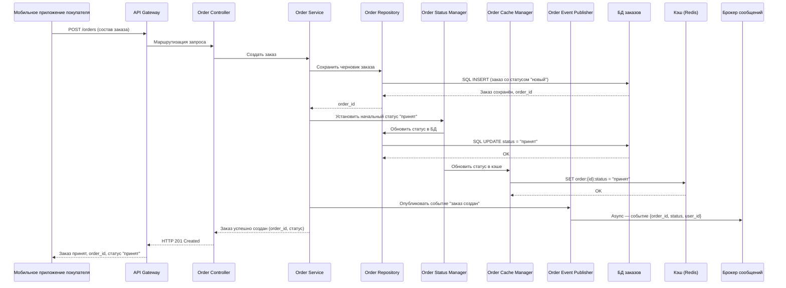
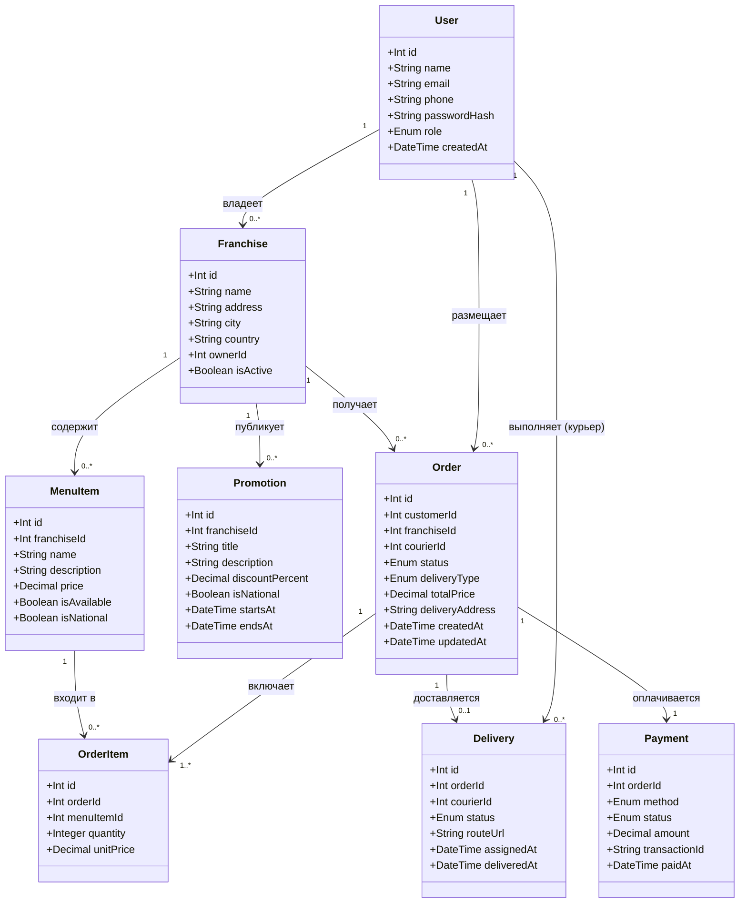

# **Либенсон А. М. РИС-22-1**

# **Проектирование архитектуры программных систем**

# ***Лабораторная работа №3***

## 

## **Тема:**

## Использование принципов проектирования на уровне методов и классов

## **Цель:**

## Получить опыт проектирования и реализации модулей с использованием принципов KISS, YAGNI, DRY, SOLID и др.

## **1. Диаграмма контейнеров**


## **2. Диаграмма компонентов контейнера "Сервис заказов"**


## **3. Диаграмма последовательностей**

Диаграмма описывает процесс взаимодействия компонентов Сервиса заказов:
1. **Приём запроса**
   Мобильное приложение отправляет `POST-запрос`. **API Gateway** маршрутизирует его в **Order Controller**, который передаёт управление в **Order Service**.
2. **Сохранение заказа**
   **Order Service** через **Order Repository** создаёт запись в БД заказов со статусом `новый`.
3. **Установка статуса**
   **Order Status Manager** переводит заказ в статус `принят`, обновляя одновременно:
   * **БД** через **Order Repository**;
   * **Кэш Redis** через **Order Cache Manager** (для быстрого чтения статуса клиентом).
4. **Публикация события**
   **Order Event Publisher** асинхронно отправляет в **Брокер сообщений** событие `заказ создан`. На него подписаны:
   * **Сервис уведомлений** (отправка push-уведомления);
   * **Сервис аналитики**.
   *Обработка происходит независимо и не блокирует основной поток.*
5. **Ответ клиенту**
   **Order Service** возвращает результат вверх по цепочке. Клиент получает подтверждение с `order_id` и текущим статусом.

## **4. Модель БД**

## Описание сущностей системы
### **User** — Универсальная сущность
Используется для всех ролей системы.
* **Поле `role`**: принимает значения `customer`, `courier`, `kitchen_staff`, `franchise_owner`, `admin`.
* Позволяет хранить всех пользователей в одной таблице и разграничивать доступ.

### **Franchise** — Магазин франшизы
* Привязан к владельцу (`ownerId` → **User**).
* Хранит географические данные для интеграции с картографическим сервисом.
* **Поле `country`**: необходимо для поддержки международного расширения.

### **MenuItem** — Позиция меню
* **Флаг `isNational`**: разграничивает позиции материнской компании от локальных позиций конкретного магазина.
* Привязка к `franchiseId` позволяет каждой франшизе формировать своё меню.

### **Promotion** — Акция
* Имеет флаг `isNational` (аналогично MenuItem): национальные акции создаёт материнская компания, локальные — владелец франшизы.
* **Поля `startsAt` / `endsAt`**: задают временной период действия акции.

### **Order** — Центральная сущность
Связующее звено между покупателем, франшизой и курьером.
* **Поле `status`**: жизненный цикл заказа (`new` → `accepted` → `preparing` → `ready` → `issued` / `delivered`).
* **Поле `deliveryType`**: `pickup` (самовывоз) или `delivery` (доставка).

### **OrderItem** — Позиция внутри заказа
* **Поле `unitPrice`**: фиксирует цену на момент оформления заказа, чтобы последующие изменения в меню не влияли на историю заказов.

### **Payment** — Платёж
Связан «один к одному» с заказом.
* **Поле `method`**: `online` / `cash`.
* **Поле `status`**: `pending` → `success` / `failed`.
* **Поле `transactionId`**: внешний идентификатор от платёжного провайдера.

### **Delivery** — Доставка
Создаётся только при условии `deliveryType = delivery`.
* Содержит ссылку на курьера и текущий статус доставки.
* **Поле `routeUrl`**: ссылка на построенный маршрут от картографического сервиса.

## **5. Применение основных принципов разработки**
## Контекст
 
Реализация относится к **Сервису заказов** платформы сэндвич-сети.  
Код охватывает серверную часть (Node.js / TypeScript) и клиентскую часть (React / TypeScript).
 
---
 
## 1. KISS — Keep It Simple, Stupid
 
> **Принцип:** каждый модуль должен решать одну задачу простым и понятным способом, без излишней сложности.
 
### Применение
 
Функция определения следующего статуса заказа написана как простой словарь переходов — без цепочек `if/else`, классов состояний или паттерна State там, где это было бы избыточно.
 
### Серверный код (Node.js / TypeScript)
 
```typescript
// server/order/getNextStatus.ts
 
type OrderStatus = "new" | "accepted" | "preparing" | "ready" | "issued";
 
// KISS: простой словарь вместо сложной машины состояний
const STATUS_TRANSITIONS: Record<OrderStatus, OrderStatus | null> = {
  new:       "accepted",
  accepted:  "preparing",
  preparing: "ready",
  ready:     "issued",
  issued:    null,
};
 
export function getNextStatus(current: OrderStatus): OrderStatus | null {
  return STATUS_TRANSITIONS[current] ?? null;
}
```
 
### Пояснение
 
Вместо введения паттерна State или цепочки условий используется единственная структура данных — объект-словарь. Логика переходов очевидна с первого взгляда, легко тестируется и расширяется добавлением одной строки.
 
---
 
## 2. YAGNI — You Aren't Gonna Need It
 
> **Принцип:** не реализовывать функциональность, которая не нужна прямо сейчас.
 
### Применение
 
При создании заказа реализуется только то, что требуется согласно текущим требованиям: сохранение заказа и публикация события. Поддержка приоритетов заказов, группировки и планировщика не добавляется, пока этого не требуют спецификации.
 
### Серверный код (Node.js / TypeScript)
 
```typescript
// server/order/createOrder.ts
 
interface CreateOrderDTO {
  customerId: string;
  franchiseId: string;
  items: { menuItemId: string; quantity: number; unitPrice: number }[];
}
 
interface Order {
  id: string;
  customerId: string;
  franchiseId: string;
  status: "new";
  totalPrice: number;
  items: CreateOrderDTO["items"];
  createdAt: Date;
}
 
// YAGNI: только необходимые поля — без приоритетов, тегов, групп и планировщика
async function createOrder(
  dto: CreateOrderDTO,
  repo: OrderRepository,
  publisher: EventPublisher
): Promise<Order> {
  const totalPrice = dto.items.reduce(
    (sum, item) => sum + item.unitPrice * item.quantity,
    0
  );
 
  const order = await repo.save({
    ...dto,
    status: "new",
    totalPrice,
    createdAt: new Date(),
  });
 
  await publisher.publish("order.created", { orderId: order.id });
 
  return order;
}
```
 
### Пояснение
 
DTO содержит только поля, необходимые для создания заказа. Такие атрибуты, как `priority`, `scheduledAt`, `tags` и т.п., не добавляются, пока они не определены в требованиях. Это уменьшает сложность модели и предотвращает разрастание схемы БД.
 
---
 
## 3. DRY — Don't Repeat Yourself
 
> **Принцип:** каждый фрагмент знания должен иметь единственное представление в системе.
 
### Применение
 
Логика форматирования статуса заказа для отображения пользователю вынесена в единую функцию/хук, используемый на всех экранах клиентского приложения.
 
### Клиентский код (React / TypeScript)
 
```typescript
// client/utils/formatOrderStatus.ts
 
type OrderStatus = "new" | "accepted" | "preparing" | "ready" | "issued";
 
// DRY: единственное место определения русских названий статусов
const STATUS_LABELS: Record<OrderStatus, string> = {
  new:       "Новый",
  accepted:  "Принят",
  preparing: "Готовится",
  ready:     "Готов",
  issued:    "Выдан",
};
 
const STATUS_COLORS: Record<OrderStatus, string> = {
  new:       "#9E9E9E",
  accepted:  "#2196F3",
  preparing: "#FF9800",
  ready:     "#4CAF50",
  issued:    "#757575",
};
 
export function getStatusLabel(status: OrderStatus): string {
  return STATUS_LABELS[status];
}
 
export function getStatusColor(status: OrderStatus): string {
  return STATUS_COLORS[status];
}
```
 
```tsx
// client/components/OrderStatusBadge.tsx
 
import { getStatusLabel, getStatusColor } from "../utils/formatOrderStatus";
 
// DRY: компонент использует единый источник данных о статусах
export function OrderStatusBadge({ status }: { status: OrderStatus }) {
  return (
    <span style={{ color: getStatusColor(status) }}>
      {getStatusLabel(status)}
    </span>
  );
}
```
 
### Пояснение
 
До применения DRY строки «Готовится», «Принят» и цвета были продублированы в нескольких компонентах: экране заказов покупателя, панели кухни и экране курьера. Теперь при изменении названия статуса достаточно исправить одну строку в `formatOrderStatus.ts`.
 
---
 
## 4. SOLID
 
### 4.1 S — Single Responsibility Principle
 
> **Принцип:** каждый класс / модуль должен иметь только одну причину для изменения.
 
#### Применение
 
Репозиторий заказов отвечает только за персистентность данных. Бизнес-логика (расчёт стоимости, переходы статусов) вынесена в отдельные модули.
 
```typescript
// server/order/OrderRepository.ts
 
// SRP: класс отвечает только за операции с БД — без бизнес-логики
export class OrderRepository {
  constructor(private readonly db: DatabaseClient) {}
 
  async save(order: Omit<Order, "id">): Promise<Order> {
    const result = await this.db.query(
      `INSERT INTO orders (customer_id, franchise_id, status, total_price, created_at)
       VALUES ($1, $2, $3, $4, $5) RETURNING *`,
      [order.customerId, order.franchiseId, order.status, order.totalPrice, order.createdAt]
    );
    return result.rows[0];
  }
 
  async findById(id: string): Promise<Order | null> {
    const result = await this.db.query(
      `SELECT * FROM orders WHERE id = $1`,
      [id]
    );
    return result.rows[0] ?? null;
  }
 
  async updateStatus(id: string, status: OrderStatus): Promise<void> {
    await this.db.query(
      `UPDATE orders SET status = $1, updated_at = NOW() WHERE id = $2`,
      [status, id]
    );
  }
}
```
 
#### Пояснение
 
`OrderRepository` изменяется только по одной причине — при изменении схемы БД или драйвера. Бизнес-правила хранятся в `OrderService`, а логика событий — в `OrderEventPublisher`.
 
---
 
### 4.2 O — Open/Closed Principle
 
> **Принцип:** модули открыты для расширения, но закрыты для изменения.
 
#### Применение
 
Система уведомлений реализована через абстракцию. Добавление нового канала (e-mail, SMS) не требует изменения существующего кода.
 
```typescript
// server/notifications/NotificationSender.ts
 
// OCP: интерфейс закрыт для изменений, открыт для новых реализаций
export interface NotificationSender {
  send(userId: string, message: string): Promise<void>;
}
 
// Реализация 1: push-уведомления (текущий канал)
export class PushNotificationSender implements NotificationSender {
  async send(userId: string, message: string): Promise<void> {
    // Отправка через FCM/APNs
    console.log(`[PUSH] → ${userId}: ${message}`);
  }
}
 
// Реализация 2: email (добавляется без изменения существующих классов)
export class EmailNotificationSender implements NotificationSender {
  async send(userId: string, message: string): Promise<void> {
    // Отправка через SMTP
    console.log(`[EMAIL] → ${userId}: ${message}`);
  }
}
 
// Потребитель зависит от интерфейса, а не от конкретной реализации
export class NotificationService {
  constructor(private readonly sender: NotificationSender) {}
 
  async notifyOrderReady(userId: string, orderId: string): Promise<void> {
    await this.sender.send(userId, `Ваш заказ #${orderId} готов!`);
  }
}
```
 
#### Пояснение
 
При добавлении SMS-уведомлений создаётся новый класс `SmsNotificationSender`, реализующий тот же интерфейс. `NotificationService` не изменяется. Конкретная реализация подставляется через Dependency Injection при инициализации сервиса.
 
---
 
### 4.3 L — Liskov Substitution Principle
 
> **Принцип:** подтипы должны быть заменяемы своими базовыми типами без нарушения корректности программы.
 
#### Применение
 
Любая реализация `OrderRepository` (реальная PostgreSQL и тестовая in-memory) должна вести себя одинаково с точки зрения вызывающего кода.
 
```typescript
// server/order/IOrderRepository.ts
 
// LSP: контракт, которому обязаны следовать все реализации
export interface IOrderRepository {
  save(order: Omit<Order, "id">): Promise<Order>;
  findById(id: string): Promise<Order | null>;
  updateStatus(id: string, status: OrderStatus): Promise<void>;
}
 
// Реальная реализация (PostgreSQL)
export class PostgresOrderRepository implements IOrderRepository {
  async save(order: Omit<Order, "id">): Promise<Order> {
    // SQL INSERT...
    return { id: "uuid-from-db", ...order } as Order;
  }
  async findById(id: string): Promise<Order | null> {
    // SQL SELECT...
    return null;
  }
  async updateStatus(id: string, status: OrderStatus): Promise<void> {
    // SQL UPDATE...
  }
}
 
// LSP: in-memory реализация полностью взаимозаменяема с PostgresOrderRepository
export class InMemoryOrderRepository implements IOrderRepository {
  private store = new Map<string, Order>();
 
  async save(order: Omit<Order, "id">): Promise<Order> {
    const saved = { id: crypto.randomUUID(), ...order } as Order;
    this.store.set(saved.id, saved);
    return saved;
  }
  async findById(id: string): Promise<Order | null> {
    return this.store.get(id) ?? null;
  }
  async updateStatus(id: string, status: OrderStatus): Promise<void> {
    const order = this.store.get(id);
    if (order) this.store.set(id, { ...order, status });
  }
}
```
 
#### Пояснение
 
`OrderService` принимает `IOrderRepository` и не знает, с какой реализацией работает. В тестах подставляется `InMemoryOrderRepository` — поведение с точки зрения бизнес-логики идентично. LSP гарантирует, что замена реализации не сломает код.
 
---
 
### 4.4 I — Interface Segregation Principle
 
> **Принцип:** клиенты не должны зависеть от методов, которые они не используют.
 
#### Применение
 
Вместо одного большого интерфейса `IOrderService` созданы отдельные интерфейсы для разных ролей.
 
```typescript
// server/order/interfaces.ts
 
// ISP: сотруднику кухни не нужно знать о создании заказа
export interface IOrderReader {
  findById(id: string): Promise<Order | null>;
  listByFranchise(franchiseId: string): Promise<Order[]>;
}
 
export interface IOrderCreator {
  createOrder(dto: CreateOrderDTO): Promise<Order>;
}
 
export interface IOrderStatusUpdater {
  updateStatus(orderId: string, status: OrderStatus): Promise<void>;
}
 
// Покупатель использует только создание и чтение
export class CustomerOrderFacade implements IOrderCreator, IOrderReader {
  constructor(private readonly service: OrderService) {}
 
  async createOrder(dto: CreateOrderDTO): Promise<Order> {
    return this.service.createOrder(dto);
  }
  async findById(id: string): Promise<Order | null> {
    return this.service.findById(id);
  }
  async listByFranchise(franchiseId: string): Promise<Order[]> {
    return this.service.listByFranchise(franchiseId);
  }
}
 
// Сотрудник кухни использует только обновление статуса и чтение
export class KitchenOrderFacade implements IOrderStatusUpdater, IOrderReader {
  constructor(private readonly service: OrderService) {}
 
  async updateStatus(orderId: string, status: OrderStatus): Promise<void> {
    return this.service.updateStatus(orderId, status);
  }
  async findById(id: string): Promise<Order | null> {
    return this.service.findById(id);
  }
  async listByFranchise(franchiseId: string): Promise<Order[]> {
    return this.service.listByFranchise(franchiseId);
  }
}
```
 
#### Пояснение
 
Сотрудник кухни работает через `KitchenOrderFacade` и видит только `updateStatus` и `findById` — метод `createOrder` для него недоступен на уровне интерфейса. Покупатель работает через `CustomerOrderFacade`. Изменение интерфейса создания заказа не затрагивает код кухни.
 
---
 
### 4.5 D — Dependency Inversion Principle
 
> **Принцип:** модули верхнего уровня не должны зависеть от модулей нижнего уровня. Оба должны зависеть от абстракций.
 
#### Применение
 
`OrderService` (высокий уровень) зависит от интерфейсов `IOrderRepository` и `EventPublisher`, а не от конкретных классов `PostgresOrderRepository` или `RabbitMQPublisher`.
 
```typescript
// server/order/OrderService.ts
 
// DIP: зависимости передаются через конструктор как интерфейсы
export class OrderService {
  constructor(
    private readonly repo: IOrderRepository,       // абстракция, не PostgresOrderRepository
    private readonly publisher: EventPublisher,     // абстракция, не RabbitMQPublisher
    private readonly statusManager: IOrderStatusManager
  ) {}
 
  async createOrder(dto: CreateOrderDTO): Promise<Order> {
    const totalPrice = dto.items.reduce(
      (sum, item) => sum + item.unitPrice * item.quantity,
      0
    );
 
    const order = await this.repo.save({ ...dto, status: "new", totalPrice, createdAt: new Date() });
    await this.statusManager.transition(order.id, "accepted");
    await this.publisher.publish("order.created", { orderId: order.id });
 
    return order;
  }
}
 
// Сборка зависимостей происходит снаружи (Composition Root)
// server/index.ts
 
const db = new DatabaseClient(process.env.DATABASE_URL!);
const repo = new PostgresOrderRepository(db);
const publisher = new RabbitMQPublisher(process.env.RABBITMQ_URL!);
const statusManager = new OrderStatusManager(repo, new RedisOrderCacheManager());
const orderService = new OrderService(repo, publisher, statusManager);
```
 
#### Пояснение
 
`OrderService` не создаёт зависимости сам — он получает их снаружи. Это позволяет в тестах подставить `InMemoryOrderRepository` и `InMemoryPublisher`, а в продакшене — реальные реализации. При замене RabbitMQ на Kafka изменяется только Composition Root, бизнес-логика не трогается.
 
---
 
## Итоговая таблица
 
| Принцип | Где применён | Эффект |
|---|---|---|
| **KISS** | `getNextStatus` — словарь переходов | Читаемость, простота тестирования |
| **YAGNI** | `CreateOrderDTO` — только нужные поля | Меньше кода, проще схема БД |
| **DRY** | `formatOrderStatus` — единый источник названий | Правка в одном месте вместо N компонентов |
| **SRP** | `OrderRepository` — только персистентность | Независимые причины изменения |
| **OCP** | `NotificationSender` — интерфейс + реализации | Добавление канала без изменения кода |
| **LSP** | `InMemoryOrderRepository` заменяет PostgreSQL | Тестируемость без реальной БД |
| **ISP** | `KitchenOrderFacade` / `CustomerOrderFacade` | Минимальный интерфейс для каждой роли |
| **DIP** | `OrderService` зависит от интерфейсов | Замена инфраструктуры без правки логики |
