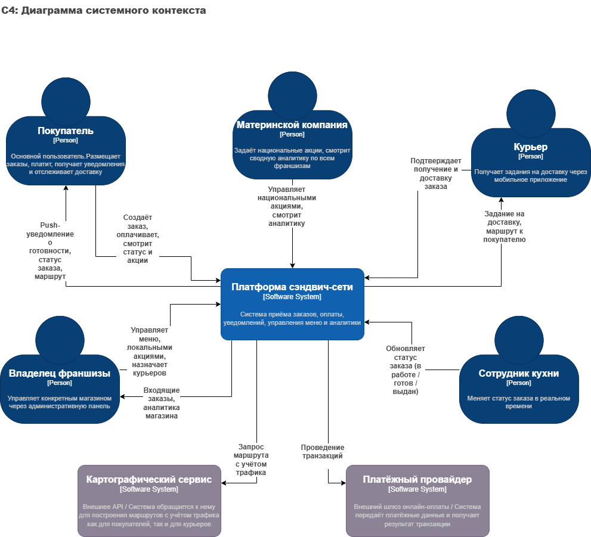
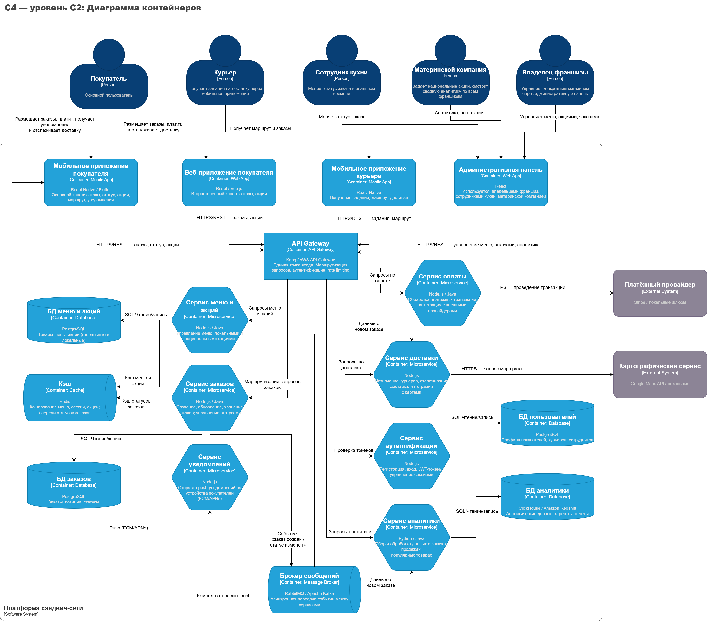
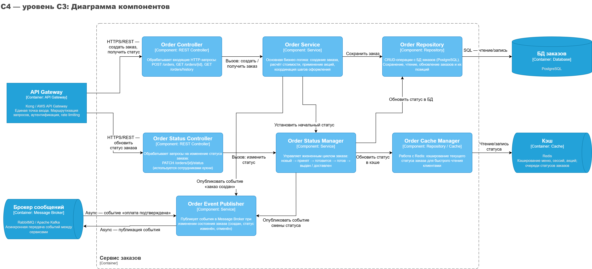

# **Либенсон А. М. РИС-22-1**

# **Проектирование архитектуры программных систем**

# ***Лабораторная работа №2***

## 

## **Тема:**

## Использование нотации C4 model для проектирования архитектуры программной системы

## **Цель:**

## Получить опыт использования графической нотации для фиксации архитектурных решений

## **Диаграмма системного контекста**

Диаграмма системного контекста отражает границы проектируемой системы и её взаимодействие с внешними пользователями и сторонними сервисами.

Основные элементы:

* Система онлайн-заказов сэндвичей (центральная система);  
* Покупатели (оформляют заказы и получают уведомления);  
* Владельцы франшиз (управляют заказами и акциями);
* Сотрудник кухни (работает на планшете или экране в кухне, меняет статус заказа в реальном времени;
* Курьеры (доставляют заказы);  
* Материнская компания (управляет национальными акциями и аналитикой);  
* Платёжный провайдер (обеспечивает онлайн-оплату);  
* Картографические сервисы (построение маршрутов с учётом трафика).

## 

## **Диаграмма контейнеров**

Диаграмма контейнеров показывает, из каких приложений и сервисов состоит система, и как они взаимодействуют между собой.

### Архитектурный стиль и обоснование выбора

Для данной системы выбирается **микросервисная архитектура** с **API Gateway** как точкой входа.

#### Обоснование:

*   **Масштабируемость** — каждый сервис масштабируется независимо. В час пик сервис заказов можно масштабировать отдельно от сервиса аналитики.
*   **Интегрируемость** — разные страны используют разные платёжные и картографические провайдеры. Микросервисы позволяют подменять интеграционный адаптер без затрагивания остальной системы.
*   **Независимая разработка** — команды IT/DevOps могут развивать сервис уведомлений и сервис аналитики параллельно.
*   **Отказоустойчивость** — сбой в сервисе аналитики не останавливает приём заказов.
*   **Облачная инфраструктура** — все магазины работают через облако материнской компании, что идеально сочетается с контейнеризацией (Docker/Kubernetes).

## **Диаграмма компонентов**

Диаграмма компонентов детализирует внутреннюю структуру контейнера "Сервис заказов".

### Краткое описание основных элементов

*   **Order Controller** — точка входа для всех запросов, связанных с созданием и просмотром заказов. Принимает запрос, валидирует его и передаёт в `Order Service`.
*   **Order Status Controller** — отдельный контроллер для операций смены статуса. Используется сотрудниками кухни и курьерами.
*   **Order Service** — ядро сервиса. Содержит всю бизнес-логику: проверяет позиции меню через `Menu Client`, инициирует оплату через `Payment Client`, сохраняет заказ через `Order Repository`.
*   **Order Status Manager** — управляет жизненным циклом заказа. Проверяет допустимость перехода между статусами (например, запрет перехода из «выдан» обратно в «готовится»), обновляет БД и кэш, инициирует публикацию события.
*   **Order Event Publisher** — единственная точка выхода асинхронных событий. Публикует в брокер сообщения, на которые подписаны Сервис уведомлений и Сервис аналитики.
*   **Order Repository** — изолирует бизнес-логику от деталей работы с PostgreSQL. Содержит SQL-запросы для работы с заказами.
*   **Order Cache Manager** — управляет кэшем статусов в Redis, чтобы клиент мог быстро получить текущий статус без обращения к основной БД.
*   **Payment Client** — HTTP-клиент для синхронного взаимодействия с соседними микросервисами.

