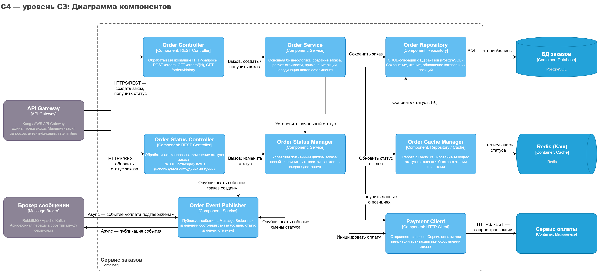
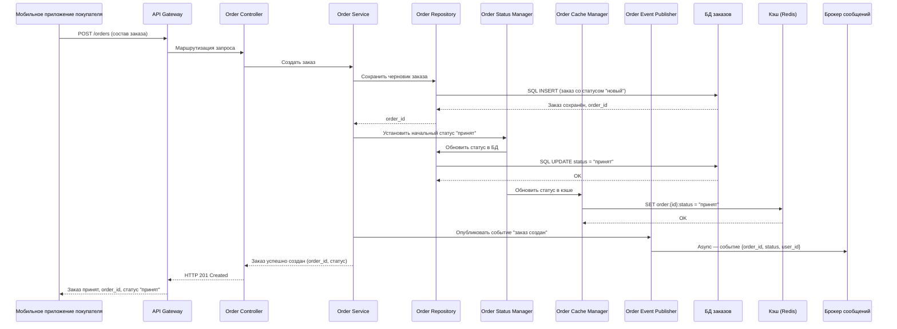

# **Либенсон А. М. РИС-22-1**

# **Проектирование архитектуры программных систем**

# ***Лабораторная работа №3***

## 

## **Тема:**

## Использование принципов проектирования на уровне методов и классов

## **Цель:**

## Получить опыт проектирования и реализации модулей с использованием принципов KISS, YAGNI, DRY, SOLID и др.

## **1. Диаграмма контейнеров**

## **2. Диаграмма компонентов контейнера "Сервис заказов"**

## **3. Диаграмма последовательностей**

Диаграмма описывает процесс взаимодействия компонентов Сервиса заказов:
1. **Приём запроса**
   Мобильное приложение отправляет `POST-запрос`. **API Gateway** маршрутизирует его в **Order Controller**, который передаёт управление в **Order Service**.
2. **Сохранение заказа**
   **Order Service** через **Order Repository** создаёт запись в БД заказов со статусом `новый`.
3. **Установка статуса**
   **Order Status Manager** переводит заказ в статус `принят`, обновляя одновременно:
   * **БД** через **Order Repository**;
   * **Кэш Redis** через **Order Cache Manager** (для быстрого чтения статуса клиентом).
4. **Публикация события**
   **Order Event Publisher** асинхронно отправляет в **Брокер сообщений** событие `заказ создан`. На него подписаны:
   * **Сервис уведомлений** (отправка push-уведомления);
   * **Сервис аналитики**.
   *Обработка происходит независимо и не блокирует основной поток.*
5. **Ответ клиенту**
   **Order Service** возвращает результат вверх по цепочке. Клиент получает подтверждение с `order_id` и текущим статусом.

## **4. Модель БД**
